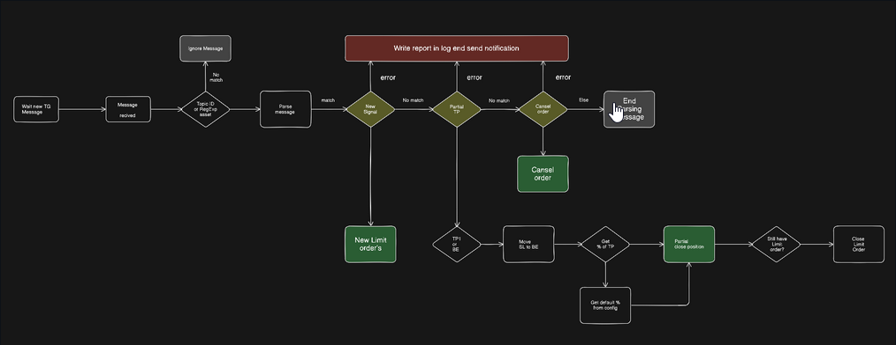

# Evening Treader group script

Parsing messages from topics and automatic work with the bybit exchange

## Possibilities
- Placing limit orders with increments and price rounding
- Move SL TO BE
- Partial closing of an order
- Cancellation of order



Instructions for Windows users
- Install Python https://www.python.org/downloads/
- Download the project and move it to a directory convenient for you
- Create a virtual environment `bash python -m venv .venv`
- Activate a virtual environment `.venv\Scripts\activate.bat`
- Install packages `pip install -r requirements.txt`
- rename .env_empty to .env and add you data in fields

## Time synchronization in Windows

If you get an error related to timestamp or `recv_window`, synchronize the system time in Windows.

Example error: invalid request, please check your server timestamp or recv_window param

```bash
sc query w32time
net stop w32time
w32tm /unregister
w32tm /register
net start w32time
w32tm /config /manualpeerlist:"time.google.com,0x8 time.cloudflare.com,0x8 time.windows.com,0x8" /syncfromflags:manual /update
w32tm /resync /rediscover
````

## Run the application 
```bash
python main.py
```

### Please send suggestions and bug reports to email 
`mihail.macnamara@gmail.com`

### You can also send us your working strategies based on these indicators. In the future, we may work on a signal parser based on your data.

## Or just send me some shekels 💰

